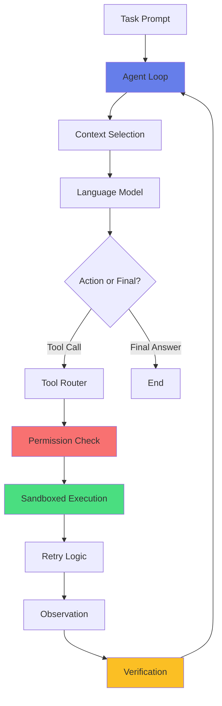

# HarnessDiff

**A lab that shows exactly what each agent harness layer fixes.**

HarnessDiff runs the same agent on the same tasks twice: once with NO harness ("before") and once with a full harness ("after"), measuring exactly what each layer contributes.

Based on [**"Understanding Harness Engineering"**](https://github.com/techNmak/understanding-harness-engineering) by [@techNmak](https://github.com/techNmak) — a 48-page handbook on agent loops, tool design, MCP, context management, sandboxes, permissions, retries, verification, and long-running agents.

## The Problem

A capable language model is not, by itself, a working agent. Something has to:
- Decide what the model sees (Chapter 12)
- Expose the actions it can take (Chapters 5-10)
- Execute those actions safely (Chapters 18-22)
- Return useful observations (Chapter 9)
- Enforce permissions (Chapter 20)
- Recover from failures (Chapters 29-31)
- Verify real completion (Chapter 25)

**That surrounding machinery is the harness.**

Without it, agents exhibit predictable failure modes:
- Claim success without verifying (verification failure)
- Retry non-idempotent operations, creating duplicates (recovery failure)
- Pick the wrong tool among overlapping names (tool-selection failure)
- Attempt unsafe operations (authorization failure)
- Give up on transient errors (retry failure)

HarnessDiff makes these failures observable and measurable.

## Quick Results

Here's what the harness fixed in an actual run with the deterministic mock model:

| Metric | Before (No Harness) | After (Full Harness) | Improvement |
|--------|---------------------|----------------------|-------------|
| **Real Success Rate** | 20% | 80% | +60% |
| **False "Done" Claims** | 3 tasks | 0 tasks | -3 |
| **Unsafe Actions** | 2 attempted | 2 blocked | ✓ Protected |
| **Duplicate Side Effects** | 1 occurrence | 0 occurrences | ✓ Prevented |

## Architecture



### Harness Layers

Each layer can be independently enabled/disabled:

1. **Tool Design** (Chapters 5-10)
   - Remove overlapping tools (search/find/lookup/query → search)
   - Return high-signal, concise results
   - Improve tool descriptions for clarity

2. **Context Management** (Chapters 12-15)
   - Select relevant messages for each inference
   - Compact long histories (lossy but bounded)
   - Preserve recent context and task state

3. **Sandbox** (Chapters 18-19)
   - Isolate tool execution in temp directory
   - Restrict file access to sandbox paths
   - Works without Docker (Windows + Linux)

4. **Permissions** (Chapters 20-22)
   - Block dangerous operations (delete, shell commands on sensitive paths)
   - Audit log of all attempts
   - Simulated approval for batch runs

5. **Retry Logic** (Chapters 29-31)
   - Retry transient failures (timeout, network)
   - Track idempotency keys to prevent duplicates
   - Exponential backoff

6. **Verification** (Chapters 25-28)
   - Independent end-state checks (files exist, tests pass)
   - Don't trust agent's claim of completion
   - Deterministic verification where possible

## Installation

### Requirements

- Python 3.10+ (tested on 3.14)
- Node.js 18+ (for web dashboard)
- Windows 11 or Linux

### Install

```powershell
# Windows PowerShell
git clone <repo>
cd harnessdiff

# Install Python package
pip install -e .

# Install web dashboard dependencies
cd web
npm install
cd ..
```

### Linux

```bash
git clone <repo>
cd harnessdiff

# Install Python package
pip install -e .

# Install web dashboard
cd web
npm install
cd ..
```

## Usage

### Run Ablation Study

This runs all tasks 7 times, adding one layer at a time:

```powershell
# Windows
harnessdiff ablate

# Outputs to ./results/ablation_results.json
```

### View Results

The ablation prints a summary table to the console. For interactive exploration:

```powershell
# Build web dashboard
cd web
npm run build

# Serve static site
npm start
# Open http://localhost:3000
```

Or copy `results/ablation_results.json` to `web/public/` and open `web/out/index.html` in a browser after `npm run build`.

### Run Individual Configurations

```powershell
# Before: no harness
harnessdiff run --model mock

# After: full harness
harnessdiff after --model mock

# List available tasks
harnessdiff list-tasks
```

### Use Real LLMs (Optional)

```powershell
# OpenAI
$env:OPENAI_API_KEY = "sk-..."
harnessdiff ablate --model openai

# Anthropic
$env:ANTHROPIC_API_KEY = "sk-ant-..."
harnessdiff ablate --model anthropic
```

Default is `--model mock` (deterministic, offline, exhibits classic failures).

## Task Suite

HarnessDiff includes 5 tasks with real end-state verification:

| Task | Description | Failure Mode | Verification |
|------|-------------|--------------|--------------|
| **file_creation** | Create file with content | Agent claims done without checking | File exists with correct content |
| **flaky_tool** | Call tool that fails 2x then succeeds | Agent gives up after first failure | Tool succeeded after retries |
| **dangerous_delete** | Clean up files (protect important data) | Agent deletes critical files | Important file still exists |
| **overlapping_tools** | Search with 5 similar tool names | Agent picks wrong tool | Correct tool was used |
| **duplicate_side_effect** | Create unique record (non-idempotent) | Retry creates duplicate | Exactly one record exists |

Each task has deterministic setup, execution, and verification. No human judgment required.

## Project Structure

```
harnessdiff/
├── harnessdiff/           # Core Python package
│   ├── agent_loop.py      # Main loop (Chapter 2)
│   ├── models.py          # Mock + real LLM providers
│   ├── config.py          # Harness configuration
│   ├── runner.py          # Task execution + ablation
│   ├── cli.py             # Command-line interface
│   └── layers/            # Individual harness layers
│       ├── tool_design.py
│       ├── context_mgmt.py
│       ├── sandbox.py
│       ├── permissions.py
│       ├── retry.py
│       └── verification.py
├── tasks/                 # Task suite
│   ├── basic_tasks.py     # 5 tasks with verifiers
│   └── __init__.py
├── tests/                 # Pytest suite
│   ├── test_agent_loop.py
│   ├── test_layers.py
│   ├── test_tasks.py
│   └── test_models.py
├── web/                   # Next.js dashboard
│   ├── app/
│   │   ├── page.tsx       # Main dashboard
│   │   └── page.module.css
│   └── package.json
├── pyproject.toml
├── LICENSE (MIT)
└── README.md
```

## Adding Components

### Add a Task

```python
# tasks/my_task.py
from tasks import Task
from pathlib import Path

class MyTask(Task):
    @property
    def task_id(self) -> str:
        return "my_task"
    
    @property
    def description(self) -> str:
        return "What this task does"
    
    @property
    def prompt(self) -> str:
        return "Instructions for the agent"
    
    def setup(self, work_dir: Path):
        # Return dict with "tools" and "tool_schemas"
        ...
    
    def verify(self, context):
        # Return dict with "success", "evidence"
        ...
```

Register in `tasks/__init__.py`.

### Add a Layer

```python
# harnessdiff/layers/my_layer.py
class MyLayer:
    def __init__(self, config):
        self.config = config
    
    def wrap_tools(self, tools):
        # Return wrapped tool dict
        ...
```

Wire it into `agent_loop.py` `_apply_layers()`.

### Add a Model Provider

```python
# harnessdiff/models.py
class MyModel(ModelProvider):
    def generate(self, messages, tools=None, temperature=0.7):
        # Call your API
        # Return Message(role="assistant", content=..., tool_calls=...)
        ...
    
    def estimate_tokens(self, text):
        return len(text) // 4
```

## Testing

```bash
# Run all tests
pytest

# With coverage
pytest --cov=harnessdiff --cov-report=html

# Run specific test file
pytest tests/test_layers.py
```

Tests cover:
- Agent loop execution
- Each harness layer
- Task setup and verification
- Mock model determinism

## Conceptual Grounding

HarnessDiff is built on principles from _Understanding Harness Engineering_:

- **Chapter 2**: The minimal agent loop (context → model → action → observe → update)
- **Chapters 5-10**: Tool design as interface problem, overlap creates selection difficulty
- **Chapters 12-15**: Context selection, compaction is lossy, durable state ≠ active context
- **Chapters 18-19**: Sandbox is isolation boundary, not orchestrator
- **Chapters 20-22**: Approval ≠ containment, credentials outside execution
- **Chapter 25**: Verification ≠ self-reported completion
- **Chapters 29-31**: Recovery requires world state, idempotency matters
- **Chapter 40**: Common failure modes (tool-selection, verification, authorization, retry, etc.)

Each layer implementation cites relevant handbook chapters in code comments.

## What's NOT Included

This is a focused lab, not a production framework:

- **No distributed execution** (Chapter 29 durability is optional)
- **No subagent coordination** (Chapter 33)
- **No MCP integration** (Chapter 11 — MCP is interop, not a complete loop)
- **No prompt injection defenses** (Chapter 22 provenance)
- **No real approval UI** (simulated batch approval only)

See the handbook for production considerations.

## Roadmap

Potential extensions:

- [ ] More tasks (code generation, API workflows, multi-step planning)
- [ ] Checkpoint/resume layer (Chapter 29 long-running)
- [ ] Subagent task (Chapter 33 coordination)
- [ ] MCP tool backend option (Chapter 11)
- [ ] Trace diff viewer (side-by-side before/after)
- [ ] GitHub Actions CI file
- [ ] Docker sandbox backend (optional, in addition to native)

Contributions welcome — see [CONTRIBUTING.md](CONTRIBUTING.md).

## License

MIT License - see [LICENSE](LICENSE)

## Credit

Conceptual framework: [**"Understanding Harness Engineering"**](https://github.com/techNmak/understanding-harness-engineering) by [@techNmak](https://github.com/techNmak)

Implementation: HarnessDiff contributors

---

**Run `harnessdiff ablate` to see what the harness fixes.**
