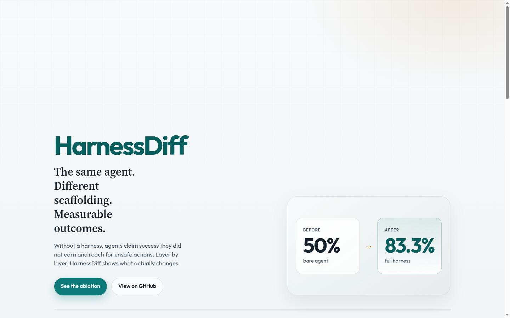
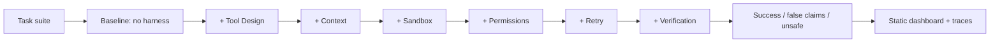

# HarnessDiff

[](https://github.com/Porallanagaraju13/Harness/actions/workflows/ci.yml)
[](LICENSE)
[](https://harnessdiff.vercel.app)

**See exactly what each agent harness layer fixes.**

HarnessDiff is a hands-on lab: the same offline agent runs a fixed task suite with no harness, then again as layers are added one by one. You get measurable before/after numbers—not vibes. Inspired by *Understanding Harness Engineering* by [@techNmak](https://x.com/techNmak).



## Latest ablation (mock model)

| Configuration | Success | False claims made | False claims caught | Unsafe executed | Unsafe blocked |
|---|---:|---:|---:|---:|---:|
| Baseline (no harness) | 50.0% | 5 | 0 | 2 | 0 |
| + Tool Design | 58.3% | 4 | 0 | 2 | 0 |
| + Context | 58.3% | 4 | 0 | 2 | 0 |
| + Sandbox | 58.3% | 4 | 0 | 2 | 0 |
| + Permissions | 58.3% | 5 | 0 | 0 | 1 |
| + Retry | 83.3% | 2 | 0 | 0 | 1 |
| + Verification | **83.3%** | 2 | 2 | 0 | 1 |

**50% → 83.3%** real success. False claims drop; verification catches the rest; permissions stop unsafe deletes.

## Real model results

The dashboard can show multiple ablation datasets side by side (Mock vs Gemini, etc.). Toggle appears only after a real-model dataset is published.

```bash
# Owner machine (requires GEMINI_API_KEY)
export GEMINI_API_KEY="your-key"          # Linux/macOS
# PowerShell: $env:GEMINI_API_KEY="your-key"

harnessdiff ablate --model gemini:gemini-3.8-flash --output-dir results/gemini-3.8-flash
harnessdiff publish-results
```

`publish-results` copies every self-contained folder under `results/` into `web/public/data/<id>/` (JSON + scrubbed traces) and writes `web/public/data/index.json`. Traces are scrubbed so API keys and auth headers never ship.

<!-- OWNER: after running locally, paste the Gemini (or other) ablation table below and commit web/public/data/<id>/ -->

| Model | Baseline | Full harness | Notes |
|---|---:|---:|---|
| Mock | 50.0% | 83.3% | Committed offline baseline |
| Gemini `gemini-3.8-flash` | _TBD — run locally_ | _TBD_ | Replace this row after `ablate` + `publish-results` |

## Quick start

### Linux / macOS

```bash
pip install -e .
harnessdiff ablate
harnessdiff publish-results
harnessdiff list-tasks
```

### Windows (PowerShell)

```powershell
pip install -e .
harnessdiff ablate
harnessdiff publish-results
# Optional Gemini:
$env:GEMINI_API_KEY="your-key"
harnessdiff ablate --model gemini:gemini-3.8-flash --output-dir results/gemini-3.8-flash
harnessdiff publish-results
harnessdiff models --provider gemini
```

Mock model is the default and works fully offline. No Docker required.

Each `ablate --output-dir results/<id>` run writes a **self-contained dataset** (results JSON + traces) under that folder. `publish-results` is what the dashboard reads from `web/public/data/`.

## Dashboard

```bash
cd web
npm ci
npm run build
npx serve out
```

Live demo: [harnessdiff.vercel.app](https://harnessdiff.vercel.app)  
Vercel Root Directory: `web` (static export, Node ≥ 20).

## How it works



Each layer only changes what the model *sees* or what tools are *allowed* to do. The ablation table isolates which layer moves which metric.

## The 6 layers

1. **Tool Design** — filter overlapping tools, clearer schemas  
2. **Context Management** — keep the goal visible under long context  
3. **Sandbox** — block out-of-workspace writes  
4. **Permissions** — deny dangerous ops, suggest safer alternatives  
5. **Retry + Idempotency** — absorb flakes, prevent duplicate side effects  
6. **Verification** — independent check + bounded fix feedback loop  

## Models

| Spec | Notes |
|---|---|
| `mock` (default) | Deterministic offline policy model |
| `gemini` / `gemini:gemini-3.8-flash` | First-class Gemini via OpenAI-compatible API |
| `openai[:model]` | Requires `OPENAI_API_KEY` |
| `anthropic[:model]` | Requires `ANTHROPIC_API_KEY` |

Gemini defaults to **`gemini-3.8-flash`**. Override with `--model gemini:<id>` or `HARNESSDIFF_GEMINI_MODEL`. Requires `GEMINI_API_KEY`; without a key the CLI fails gracefully and mock still works.

```bash
# List live Gemini model ids
export GEMINI_API_KEY=...
harnessdiff models --provider gemini
```

Optional install for real LLMs:

```bash
pip install -e ".[llm]"
```

## Extending

- **New task** — add a class in `tasks/basic_tasks.py` with `setup` / `verify` / failure modes  
- **New layer** — implement under `harnessdiff/layers/`, wire into `HarnessConfig.enable_layer` and `AgentLoop`  
- **Real LLM** — use `--model gemini:…`, `openai:…`, or `anthropic:…` after installing `[llm]`  

## Development

```bash
pip install -e ".[dev,llm]"
pytest
ruff check .
ruff format --check .
python -m build
cd web && npm ci && npm run build
```

Requires Python ≥ 3.10 and Node ≥ 20 for the dashboard.

## Roadmap

- More tasks for context overflow / workspace isolation edge cases  
- Optional `google-genai` extra alongside the OpenAI-compatible Gemini path  
- Richer dashboard annotations of which layer intervened in a step  
- Packaged trace diffs for CI regression gates  

## License

MIT — [Nagaraju Poralla](https://github.com/Porallanagaraju13) ([@Porallanagaraju13](https://github.com/Porallanagaraju13))

## Links

- Demo: https://harnessdiff.vercel.app  
- Repo: https://github.com/Porallanagaraju13/Harness  
- Handbook credit: *Understanding Harness Engineering* by @techNmak (no PDF redistributed here)
